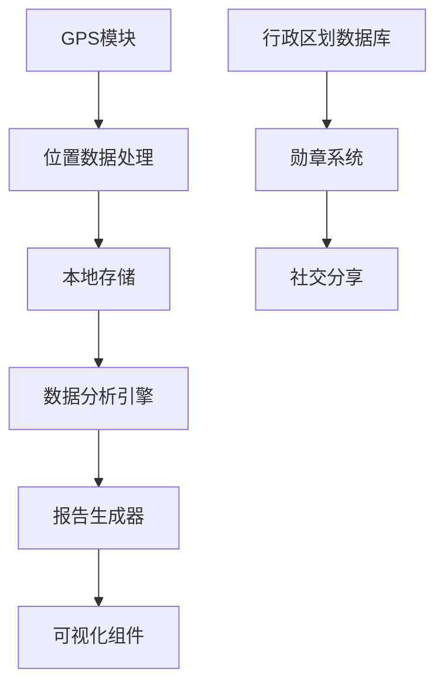

# 足迹探索 (FootprintExplorer) 

一款通过GPS记录用户活动轨迹、生成可视化报告并解锁地域特色勋章的安卓应用

以下功能将逐步实现

## 功能概览

### 📍 智能位置记录

- **双模式定位**
  - 手动记录模式（适合省电场景）
  - 后台实时记录模式（持续追踪）
- **灵活配置**
  - 可自定义记录频率（1分钟 - 1小时）
  - 支持运动类型识别（步行/跑步/骑行）
- **数据安全**
  - 本地加密存储位置数据
  - 可选云同步功能

### 📊 多维数据分析报告

| 报告类型 | 包含指标                 | 可视化形式            |
| -------- | ------------------------ | --------------------- |
| 周报     | • 移动距离 • 热点区域 | 热力图+折线图         |
| 月报     | • 新地点数 • 停留时长 | 3D柱状图+轨迹动画     |
| 年报     | • 城市覆盖 • 勋章进度 | 交互式地图+数据仪表盘 |

### 🏆 地域勋章系统

- **分级解锁机制**
- **特色分类**
- 🍜 美食探索家（解锁地方小吃）
- 🏺 文化守护者（访问历史遗迹）
- 🐼 生态观察员（发现自然保护区）
- **勋章特权**
- 获取当地商家优惠
- 参与成就排行榜
- 分享专属纪念卡片

## 技术架构

